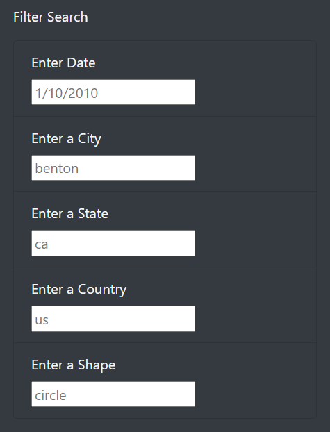

# UFOs
*A JavaScript Interactive webpage*

## Overview of Project
### Purpose

The purpose of this project is to build a **dynamic webpage** that displays UFO sighting information. There is a lot of data to display so adding filters to the table which let users to refine their search on more than one level is absolutely necessary.  
The web-page contains the following:

-	Brief article and its summary.
-	An attention-grabbing header with a refresh-page button.
-	Interactive filters for searching criteria on date, city, country and shape.
-	Visually appealing design of overall presentation of the data.

  <i> A snippet from the header of the webpage. </i>

### Background
For this project I am using **JavaScript** as the primary coding language. It is a lightweight OOP (object-oriented programing language) also known as a front-end development language and is most commonly used as a part of web pages. JavaScript adds extra functionality and customization to webpages in order to enhance user experience. Besides JavaScript I am also using the following to build the dynamic web-page:

-	The data for the table is stored in a JavaScript array. [data.js](static/js/data.js).
-	The table is built by inserting **JavaScript** into HTML page. [app.py]( static/js/app.js).
-	**HTML** to build the webpage [index.html](index.html).
-	**CSS** and **Bootstrap** to build and style the page [style.css](static/css/style.css)
-	**Chrome Developer Tools** to test the code.

## Resources

- **Data Source:** JavaScript list [data.js](static/js/data.js)
- **Software:** VS Code and Chrome Developer Tools, 
- **Languages:** JavaScript, HTML, CSS and Bootstrap 3
- **Dependencies:** D3

## Results
Raw data from JavaScript array is now displayed in a dynamic table where users can filter data on multiple criteria by **date**, **city**, **state**, **country** and **shape** of UFOs sighting. In the filter input box is suggested text of how search criteria should be entered by user. For example, date should be entered in format as in 1/10/2010 – with forward slashes and without extra 0 before day and month. City, state, country and shape should be entered in lower case.

  <i> Dynamic multi-filter search </i>

When user types desired criteria in multi-filter and then press enter the table displays only rows that matches the user input.

  <i>  Example input: State: ca, Shape: triangle and Date: 1/1/2010. New table, displays only the results that matches the users input </i>

When resetting the filter, the user has two choices. User can either can clear input manually deleting input cell by cell or click the refresh button *UFO Sightings* that can be found at the top left corner of the page. After the filter is cleared, the user can use filter again.

## Summary
To build dynamic webpages that accept user inputs and visually adjust to reflect that interaction require quite a bit of work and patience. As I am pleased with the work, there is always room for improvement. I would like to address some drawbacks and recommendations for this interactive webpage.

### Drawbacks
•	**All the data is displayed at once** which makes the entire web-page quite lengthy.

•	**Reset button is too far away from the filter** which is inconvenient, especially on smaller screens, where user has to scroll up to reach the reset button and clear out the filter. 

### Recommendations for further analysis

•	**Converting all input to lower case.** Adding an additional line of code that that would convert all letters to lower case from user input. In this case, the search criteria capabilities have much wider range and will improve user’s experience.  For example, it wouldn’t matter if user types “CA” or “Ca” instead of “ca”, the code will still be able to process and find the results.

•	**Adding drop down-menu instead of text input**. Users may not be aware of what filter inputs they are able to use. We could increase positive user experience by adding a drop-down menu. In this case, the user won’t have to guess what options they have and they won't have to worry about typos when attempting to filter the data.
